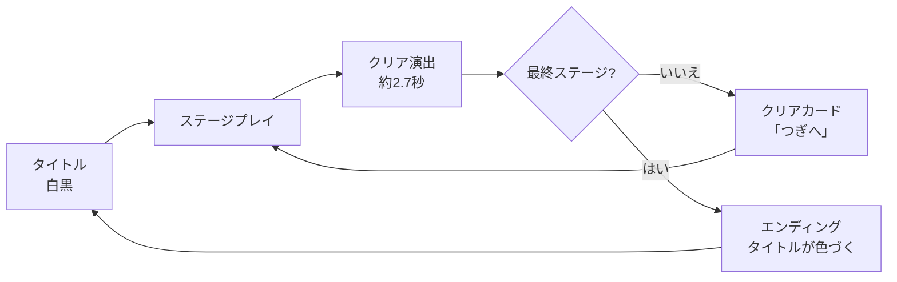

# かんせいのパレット 要件定義書

2026-09-25 · ゲームの仕様、演出、アセット、要件のすべて。対になる資料: 企画書.md(章番号は共通です)

## 3. ゲームデザイン

プレイヤーはタイルをタップして90度ずつ回し、電源からすべてのゴールまで電気を通すとステージクリアです。失敗や制限時間はありません。

### ゲームの流れ



エンディングのタイトル画面から「もういちど あそぶ」を押すと、色と小物をリセットしてステージ1から始まります。

### コアループ

1. 盤面を見て、電源とゴールの位置を把握する。
2. タイルをタップして回転させる。
3. 電気の通り道が色と光で広がるのを確認する(即時フィードバック)。
4. すべてのゴールが点灯するまで繰り返す。
5. クリア演出で色が戻り、次のステージへ進む。

### タイルの種類

接続方向は基準の向き(回転数 0)での値です。N=上(北)、E=右、S=下、W=左。

| 記号 | 名前 | 接続方向(基準) | 回転 | 役割 | 画像ファイル |
| --- | --- | --- | --- | --- | --- |
| S | 直線 | N, S | 可 | 電気をまっすぐ通す | tile\_straight |
| C | 曲がり | N, E | 可 | 電気を直角に曲げる | tile\_corner |
| T | T字 | N, E, W | 可 | 電気を3方向に分ける | tile\_tee |
| X | 十字 | N, E, S, W | 可(見た目は変わらない) | 電気を4方向に分ける | tile\_cross |
| P | 電源 | S | 不可 | 電気の出発点。向きはステージデータで決める | tile\_source |
| G | ゴール | N | 不可 | 電気が届くと点灯。向きはステージデータで決める | tile\_goal |
| L | ロック直線 | N, S | 不可 | 回せない直線。解答の手がかりにもなる | tile\_locked |
| B | 空き | なし | 不可(本番の推奨) | 電気を通さない。盤面の強弱とダミー | tile\_blank |

プロトタイプでは空きタイルもタップで回転しますが、見た目は変わりません。本番では回せないタイルとして扱います。

### 回転のルール

- 1タップで時計回りに90度。回転数は0〜3を循環します。
- 接続方向は4ビットで表します(N=1, E=2, S=4, W=8)。時計回りに1回転すると、各ビットが N→E→S→W→N の順で移ります。
- 演出としてはバネで回転し、少し行き過ぎて戻ります。内部の回転数はタップした瞬間に確定し、判定はアニメーションを待たずに行います。
- 回せないタイルをタップすると、タイルが小さくはねて低い音が鳴ります。ロックタイルの場合、主人公が汗をかく表情になります。

### 通電の判定

1. 電源タイル(P)を起点とし、幅優先探索で電気の届くタイルを求める。
2. 隣り合うタイルに電気が渡る条件は、向かい合う辺の両方に接点があること。片側だけではつながらない。
3. 各タイルに電源からの距離 d(電源=0)を記録する。色の広がり方に使う。
4. タイルを回すたびに、盤面全体で再計算する。
5. 分岐や行き止まりがあっても、接続している部分はすべて通電する。

### クリア条件とマイクロフィードバック

- 盤面上のすべてのゴール(G)に電気が届いたらクリア。判定はタイルを回した直後に行います。
- ゴールの進捗を、画面下の「ゴール 1 / 3」のような表示で常に見せます。
- 手数・時間の計測とスコアはありません(本ジャムではスコープ外)。

### 操作

| 操作 | 動作 |
| --- | --- |
| マウス左クリック / タップ | タイルを時計回りに90度回す |
| マウスのホバー | 回せるタイルが少し浮き、カーソルがポインターになる |
| R キー / 「やりなおす」ボタン | ステージを初期状態に戻す(主人公は目を回す) |
| Enter / Space | タイトルで「はじめる」、クリアカードで「つぎへ」 |
| 「音」ボタン | 音のON/OFFを切り替える |

### 主人公の反応

| 状況 | ポーズ |
| --- | --- |
| ステージ開始 | マスの左側へ走って入ってくる(走り)→ 待機 |
| プレイ中 | 待機(少し呼吸する) |
| ロックタイルをタップ | 汗をかく(約1.1秒) |
| 14秒間操作しない | 考え込む(ひらめきマーク、約3.2秒)。そのあとタイマーを8秒に戻し、さらに6秒操作がなければ再び考え込む |
| やりなおす | 目が回る(約0.9秒) |
| クリア演出 | 喜び(バンザイ)。ジャンプしながら、クリア演出のあいだ繰り返す |
| エンディング | 星が強い喜びのポーズ |

## 4. ステージ設計

ステージは5×5マスの盤面をで3つで、ステージごとに「新しいルール」で1つと「戻る色」1つを割り当てます。ステージデータはコードに埋め込まず、データとして外に出します。

### ステージ一覧

| ステージ | 名前 | 戻る色 | 新しい要素 | ゴール数 | 回せるタイル数(空き・固定を除く) | 解答に必要なタイル数 |
| --- | --- | --- | --- | --- | --- | --- |
| 1 | あか | 赤 | とおり道をつなぐ(直線と曲がりの基本) | 1 | 15 | 7 |
| 2 | あお | 青 | ロックタイル、T字による分岐、ゴール2つ | 2 | 15 | 4 |
| 3 | きいろ・みどり | 黄・緑 | 十字タイルからの3分岐、ゴール3つ | 3 | 15 | 9 |

### ステージデータの記法

1マスは2文字で、タイル記号(前章の表)+ 初期の回転数(0〜3)です。回転数は時計回りの90度単位です。段ごとにスペース区切りで上から下へ並べます。例: `P3` = 電源を時計回りに3回回した向き(下向きから右向きへ)。

### ステージ1: あか

```text
C2 B0 S1 B0 G2
B0 T0 B0 C1 S1
B0 S1 C0 S0 C1
C3 B0 S1 B0 S0
P3 S0 C0 B0 C2
```

解答に必要な回転数(行,列 = 上から0始まり)は次のとおりです。上記以外のタイルはダミーです。

| 位置(行,列) | 種類 | 初期 | 解答 |
| --- | --- | --- | --- |
| 4,0 | 電源 P | 3 | 3(固定) |
| 4,1 | 直線 S | 0 | 1 |
| 4,2 | 曲がり C | 0 | 3 |
| 3,2 | 直線 S | 1 | 0 |
| 2,2 | 曲がり C | 0 | 1 |
| 2,3 | 直線 S | 0 | 1 |
| 2,4 | 曲がり C | 1 | 3 |
| 1,4 | 直線 S | 1 | 0 |
| 0,4 | ゴール G | 2 | 2(固定) |

電源は左下、ゴールは右上にあり、道はひと筆書きです。初めてのプレイでも、電源から順に1つずつ直していけば解けます。

### ステージ2: あお

```text
C1 B0 S1 T2 C3
G2 C0 B0 S1 B0
C2 S0 T0 S0 G3
B0 C2 L0 C0 S1
S1 B0 P2 B0 C1
```

電源は下中央で上向き、ロックタイルを通って中央のT字で左右に分かれます。ゴールは左の上段と右の中段の2つです。

| 位置(行,列) | 種類 | 初期 | 解答 |
| --- | --- | --- | --- |
| 4,2 | 電源 P | 2 | 2(固定) |
| 3,2 | ロック L | 0 | 0(固定) |
| 2,2 | T字 T | 0 | 2 |
| 2,1 | 直線 S | 0 | 1 |
| 2,0 | 曲がり C | 2 | 0 |
| 1,0 | ゴール G | 2 | 2(固定) |
| 2,3 | 直線 S | 0 | 1 |
| 2,4 | ゴール G | 3 | 3(固定) |

### ステージ3: きいろ・みどり

```text
P3 S0 C1 C2 B0
C3 C0 X0 S0 C0
B0 S1 L0 T1 S1
G1 C2 S1 B0 G0
S1 B0 G0 C0 B0
```

電源は左上で、十字タイル(1,2)から下・右・左の3方向に分かれ、それぞれにゴールがあります。

| 位置(行,列) | 種類 | 初期 | 解答 |
| --- | --- | --- | --- |
| 0,0 | 電源 P | 3 | 3(固定) |
| 0,1 | 直線 S | 0 | 1 |
| 0,2 | 曲がり C | 1 | 2 |
| 1,2 | 十字 X | 0 | 任意 |
| 2,2 | ロック L | 0 | 0(固定) |
| 3,2 | 直線 S | 1 | 0 |
| 4,2 | ゴール G | 0 | 0(固定) |
| 1,3 | 直線 S | 0 | 1 |
| 1,4 | 曲がり C | 0 | 2 |
| 2,4 | 直線 S | 1 | 0 |
| 3,4 | ゴール G | 0 | 0(固定) |
| 1,1 | 曲がり C | 0 | 1 |
| 2,1 | 直線 S | 1 | 0 |
| 3,1 | 曲がり C | 2 | 3 |
| 3,0 | ゴール G | 1 | 1(固定) |

### ステージデータの検証

3ステージとも、初期状態ではクリアしていないこと、上記の解答で必ずクリアできることを、プロトタイプの判定ロジックと同じ計算で確認済みです。ブラウザ上でも、解答を順に適用して3ステージともクリアし、エンディングに到達しました。別の解があるかは未検証です(ダミータイルによる近道は許容)。

### ステージごとのヒント文

| ステージ | 画面下のヒント |
| --- | --- |
| 1 | タイルをタップして回そう。でんきを ゴールまで とどける |
| 2 | カギのタイルは回せない。ゴールは ふたつ |
| 3 | 十字のタイルから さんぽんに わかれる。ぜんぶ つなごう |

### 難易度の方針

回せるタイルはどのステージも 15 枚です。そのうち解答に必要なのは、1面で7枚、2面で4枚、3面で9枚です。ステージを進むほど枚数と分岐が増えます。ジャム後にステージを足す場合は、この比率を参考にします。

## 5. 演出とビジュアル仕様

見た目の軸は、上から見下ろす固定カメラの3D箱庭と、そこに立つ手描き風の立ち絵(HD-2D風)です。以下の数値はプロトタイプの実装値で、本番実装の初期値として使い、実際に見て微調整します。

### カメラと世界

| 項目 | 値 |
| --- | --- |
| カメラ | 透視投影、縦の視野角 32度、俯角 50度で固定 |
| 注視点 | (0, 0.5, -0.2)。カメラ距離は画面の縦横比で自動調整し、横幅は世界単位で6.9〜9.6、縦幅は8.6を見せる |
| 視差 | ポインター位置に応じてカメラを横に最大 0.55、縦に最大 0.25 動かす |
| タイル | 1マス = 1.0。タイル画像は接点が枠の外に出るため 1.155 倍で貼る |
| 箱庭 | 台座 6×0.32×6、タイル下の板 5.5×5.5、地面 半径30、苝生の内側 半径10.5 |
| 立ち絵 | 足元を基準にして立て、俯角の0.9倍(45度)だけカメラに傾ける。足元に軏い影を敲く |
| ぼかしと減光 | プロトタイプでは、画面の上下20%にCSSの4pxのぼかし(疑似チルトシフト)と、周辺減光を掛ける |

本番(raylib)ではシェーダーを使うとWebで手間が増えるため、ぼかしと減光はスコープ外として扱います。色の復元(下記)だけはシェーダーが必要です。

### 色の復元

色はピクセルの色相で判定し、復元していない色相は輝度だけのグレーにします。式は次のとおりです。

```text
h = ピクセルの色相(0〜360度)
k = clamp( band(h,赤)×r + band(h,青)×b + band(h,黄緑)×g , 0, 1 )
k = max( k, min(r, b, g) )      // 全色が戻ったら完全な彩色
k = max( k, タイル自身の通電度 )   // 電気が通ったタイルはその場で彩色
グレー gray = (輝度 - 0.5) × 1.06 + 0.5
出力色 = mix(gray, 元の色, k)
```

`band(h, 中心, 内側, 外側)` は、中心の色相からの距離が内側以下なら1、外側以上なら0、その間は滑らかに変化する値です。

| 帯 | 中心の色相 | 内側 | 外側 | 戻るステージ | 例 |
| --- | --- | --- | --- | --- | --- |
| 赤(r) | 5度 | 22度 | 48度 | 1 | 屋根、赤い花、マフラー、橙の配線 |
| 青(b) | 232度 | 50度 | 78度 | 2 | 噪水の水、青い花、青い配線、気球の青 |
| 黄緑(g) | 95度 | 45度 | 70度 | 3 | 木と苝、街灯の光、黄色い花 |

復元度(r, b, g)はステージクリアで 0→1 になり、毎秒1.7の割合で目標へ指数的に近づき、約1.4秒で約9割に達します。地面・台座・空の色も同じ式で彩度を落とします(CPU側で計算)。

### 通電の演出

- 電源からの距離 d で、タイルの色づくタイミングを d × 0.085 秒遅らせる(電気が流れていく見え方)。
- 通電度は立ち上がりを毎秒9、断電時の低下を毎秒16で接近させる。断電は待たせずすぐに消す。
- 通電中のタイルには、加算合成の光(タイルの1.9倍の大きさ)を重ねる。不透明度は通常 0.5、ゴールは 0.95、脆動は 0.82±0.18(毎秒 約0.64回)。
- 光の色はタイルの種類で決まります: 直線 #5ac8ff、曲がり #ffb347、T字 #7dff7a、十字 #c88bff、電源 #7fe3ff、ゴール #ffe27a、ロック #ff6b5f。

### タイルの動き

| 動き | 仕様 |
| --- | --- |
| 回転 | バネ(強さ 260、減衰 23)で 90度回す。少し行き過ぎて止まる |
| タップ時 | 大きさが一瞬 7% 大きくなり、元に戻る(毎秒9の割合で減衰) |
| ホバー | 回せるタイルが 0.05 浮き、 4.5% 大きくなる |
| 回せないタイルをタップ | 一瞬はねて、回転のバネに少し勢いを与える(回転は変わらない) |

### クリア演出のタイムライン

| 時刻 | 内容 |
| --- | --- |
| 0.00秒 | クリア音(5音の上昇)。ゴールの光を 1.4 倍に。白いフラッシュ(不透明度 0.55、0.9秒で消える)。カメラを揺らす(強さ 0.32、毎秒6で減衰) |
| 0.00秒 | 各ゴールから星くずを 70 粒、地面に広がる輪(半径 3.4)。盤面全体にも輪(半径 7.5)。主人公は嗜びのポーズ |
| 0.45秒 | 色の復元を開始、ステージの小物が 0.12 秒ごとに順にせり上がる(バネ強さ 190、減衰 13)。小物ごとに星くず 26 粒。色が戻る和音。画面の強調色をそのステージの色に変える |
| 2.70秒 | 最終ステージ以外: クリアカードを表示。最終ステージ: 強いフラッシュ、さらに 0.5 秒後にエンディングへ |

星くずは加算合成の点の集まりです。上限 700 粒を使い回し、審命 0.9〜1.9 秒、重力 5.2、地面でバウンドして速さは 0.35 倍になります。クリア時の粒の色はステージごとの4色です。

### エンディング

- 全ての色相が戻り、全ての小物がせり上がった状態でタイトル画面に戻る。
- タイトルの文字(9文字)が、左から 0.11 秒遅らせて、それぞれ 1.1 秒かけて色づく。
- パレットのエンブレムが光り、色とりどりの星くずが降り続ける。主人公は星を伴う喜びのポーズ。
- メッセージ: 「ぜんぶ、いろづいた。」と、「主人公は、はじめて世界の色を見た。」。

### 小物と主人公の配置

座標はワールド単位で、X=右、Z=手前です(盤面中心が 0,0)。高さはワールド単位です。

| ステージ | 小物 | 高さ | X | Z | 備考 |
| --- | --- | --- | --- | --- | --- |
| 1 | 家(cottage) | 1.9 | -3.9 | -2.1 |  |
| 1 | 花壇(flowers) | 0.8 | 3.9 | -1.3 |  |
| 1 | 柵(fence) | 0.85 | 3.8 | 0.5 |  |
| 2 | 噪水(fountain) | 1.35 | 3.8 | 2.1 |  |
| 2 | 街灯(lamp) | 1.9 | -4.1 | -0.2 |  |
| 2 | 気球(balloon) | 2.4 | 1.9 | -4.3 | 地面から 0.9 浮かせ、上下にゆらゆらさせる |
| 3 | 木(tree) | 2.3 | 0.2 | -3.7 |  |
| 3 | 松(pine) | 2.6 | -1.9 | -3.9 |  |
| 3 | 松(pine) | 2.6 | 4.4 | -2.7 |  |
| 3 | 木(tree) | 2.3 | -4.6 | 1.2 | 左右反転 |

| 主人公 | 位置(X, Z) |
| --- | --- |
| プレイ中の立ち位置 | (-3.7, 2.2) |
| タイトルでの立ち位置 | (-1.9, 2.3) |
| ステージ開始時の走り始め | (-9.0, 2.2)から右へ、移動速度 5.4/秒 |
| 大きさ | 画像 1px = 0.0078。待機ポーズ(約172px)で高さ約1.34 |
| パレット(タイトル) | 高さ 2.4、位置 (0.7, 0.5)、上下にゆらゆらする |

## 6. UIとサウンド仕様

UIはモノクロの枠だけで始め、ステージをクリアするごとに強調色が赤→青→緑と変わります。サウンドはすべて短い効果音で、BGMはジャムでは必須としません。

### 画面一覧

| 画面 | 内容 |
| --- | --- |
| 読み込み | バー付きの「よみこみ中」。すべての画像がそろうまで表示 |
| タイトル | 白黒の箱庭、主人公、大きなパレット、タイトル文字、「はじめる」ボタン |
| プレイ | プレイ画面とHUD |
| クリアカード | ステージクリア後、画面下に表示。「つぎへ」ボタン |
| エンディング | 色づいたタイトル画面。「もういちど あそぶ」ボタン |

### タイトル画面

| 要素 | 初回 | エンディング後 |
| --- | --- | --- |
| タイトル文字 | 「かんせいのパレット」をグレーで表示 | 文字ごとに色づく |
| サブタイトル | KANSEI PALETTE | ぜんぶ、いろづいた。 |
| キャプション | せかいの いろを うしなった ひとの ものがたり | 主人公は、はじめて世界の色を見た。 |
| ボタン | はじめる | もういちど あそぶ |
| 主人公 | 待機 | 星を伴う喜びのポーズ |

タイトル文字の色(9文字の順): #e5493f #f08a2c #f3c21f #8bc34a #4cb85a #2fb5c9 #3d8bea #7b5cd6 #c257c4。文字の大きさは画面幅の7.2%(34〜84px)です。

### HUD(プレイ中)

| 位置 | 内容 |
| --- | --- |
| 左上 | 「STAGE n / 3」、ステージ名、取り戻した色の丸を3つ(未取得はグレー、取得すると赤・青・黄緑になり、少し大きくなる) |
| 右上 | 「やりなおす (R)」「音 ON/OFF」ボタン(プロトタイプでは「素材」ボタンもある) |
| 下 | ヒント文と、「ゴール 点灯数 / 全体」 |

### クリアカード

ステージの強調色の丸、「○○が もどった」(例: あおが もどった)、「あと N つの いろ」、「つぎへ」ボタンです。ボタンを押すと、主人公が右へ走って入ってくる演出とともに次のステージが始まります。

### 強調色とフォント

| 項目 | 仕様 |
| --- | --- |
| 強調色 | 初期 #3a3a3a。ステージ1クリア後 #e5493f、ステージ2後 #3d8bea、ステージ3後 #4cb85a、エンディング #e5493f |
| フォント | 丸ゴシック体。プロトタイプは Zen Maru Gothic(太さ 500/700/900)。本番はライセンスを確認した日本語フォントを、使う文字だけに絞って埋め込む |
| ボタン | 丸みのあるカプセル型。押しているときは3px沈む |

### レスポンシブとアクセシビリティ

- 縦長のスマートフォンでは盤面が画面幅いっぱいになり、HUDは折り返します。
- 回路は形だけで解け、色はヒントに使いません。
- キーボード(R、Enter、Space)で、ボタン操作ができます。
- モーション削減設定では、フラッシュを約3割、カメラ揺れをなし、星くずを約3分の1にします(このブラウザ設定をライブラリ側で取得できる場合)。

### サウンド

ブラウザの自動再生制限に従い、最初のクリック(「はじめる」)でオーディオを初期化します。プロトタイプはブラウザのシンセで直接鳴らしています。本番はこの音を参考にした短い効果音ファイルを用意し、人作でもフリー素材でも構いません(ライセンスは要確認)。

| 効果音 | タイミング | プロトタイプの音 |
| --- | --- | --- |
| 回転 | タイルをタップ | 矩形波 約430Hz の 0.08 秒に、860Hz の三角波を 0.02 秒遅らせて重ねる |
| ゴール点灯 | ゴールに電気が届く | 三角波 0.22 秒。点灯したゴール数に応じて、523、587、659、784、880、988、1175Hz の順に高くなる |
| クリア | 全ゴール点灯 | 523、659、784、1047、1319Hz を 0.09 秒間隔で重ね、オクターブ上を薄く重ねる |
| 色が戻る | クリアの 0.45 秒後 | 392、494、587、784Hz を 0.12 秒間隔、長めの残響 |
| エンディング | タイトルが色づく | 523、659、784、988、1175、1568Hz を 0.12 秒間隔、 1.4 秒の余韻 |
| 回せない | 固定タイルをタップ | 矩形波 180Hz の 0.12 秒 |
| やりなおし | ボタン | のこぎり波 300Hz の 0.15 秒 |

ステージを進めるとBGMの楽器が増える案は、余裕があればの追加要素です(本書ではスコープ外)。

## 7. アセット仕様

画像はすべて透過付きPNGで1枚1ファイルに分け、同じファイル名で置き換えるだけで差し替えられる構成にします。彩度を落とした白黒版は用意せず、すべてフルカラーで作ります。プロトタイプでは、ゲーム内の「素材」ボタンから実際に差し替えを試せます。

### フォルダ構成

```text
assets/
  palette.png
  tile_straight.png  tile_corner.png  tile_tee.png  tile_cross.png
  tile_source.png    tile_goal.png    tile_locked.png tile_blank.png
  prop_cottage.png   prop_flowers.png prop_fence.png  prop_fountain.png
  prop_lamp.png      prop_balloon.png prop_tree.png   prop_pine.png
  hero/
    idle_0..5.png  run_0..10.png  cheer_0..2.png  map_0..3.png
    think.png  joy_star.png  surprise.png  dizzy.png  sweat.png
    talk.png  back.png  sit.png  sleep.png
```

合計は 50 枚です(うち主人公 33 枚)。合計サイズは約2.5MBです。

### 共通ルール

| 項目 | ルール |
| --- | --- |
| 形式 | PNG(RGBA)。背景は透過 |
| 生成時の背景 | 完全に均一なマゼンタ(#FF00FF)。後で透過処理します |
| 文字 | 画像に文字を入れない(タイトルはゲーム側でフォント表示) |
| 色 | 彩度の高いフルカラー。白黒はコードで作る |
| 画風 | 手描き風で、ドット絵の雰囲気を少し残す。すべての画像で揃える |
| 影 | 小物の足元の影は画像に含めてよい(半透明の暗い影)。ゲーム側でも影を重ねる |

### タイル

上から真下に見た正方形で、回路の接点は各辺の中心にぴったり合わせます。隣のタイルとのつなぎ目がずれると、通電の見た目が不自然になります。

| ファイル | 接続(画像の向き) | サイズ(約) |
| --- | --- | --- |
| tile\_straight | 上と下 | 164×164 px |
| tile\_corner | 上と右 | 164×164 px |
| tile\_tee | 上・右・左 | 164×164 px |
| tile\_cross | 上・右・下・左 | 164×164 px |
| tile\_source | 下(クリスタル付き) | 164×164 px |
| tile\_goal | 上(電球付き。点灯は光の重ねで表現) | 164×164 px |
| tile\_locked | 上と下(鍵のアイコン付き) | 164×164 px |
| tile\_blank | なし | 164×164 px |

タイル1枚の中の、石の枠(プレート)は約142pxです。接点の丸が枠の外に少し出るため、画像全体をマスの 1.155 倍(164/142)で貼り、枠がちょうど1マスになります。

### 小物とパレット

小物は高さを固定し、幅は画像の縦横比に合わせます。別のサイズの画像に差し替えても、コードは変えずに合います。足元の中心が画像の下辺中央に来るようにしてください。

| ファイル | サイズ(約) | ゲーム内の高さ |
| --- | --- | --- |
| prop\_cottage | 184×208 | 1.9 |
| prop\_flowers | 158×124 | 0.8 |
| prop\_fence | 142×117 | 0.85 |
| prop\_fountain | 180×188 | 1.35 |
| prop\_lamp | 92×229 | 1.9 |
| prop\_balloon | 153×238 | 2.4 |
| prop\_tree | 153×206 | 2.3 |
| prop\_pine | 141×222 | 2.6 |
| palette | 459×451 | 2.4(タイトルで使用) |

### 主人公

全フレームを同じ倍率(1px = 0.0078)で表示し、足元を基準に立てます。ポーズによって画像の大きさが違うのは、ポーズの大きさがそのまま反映されるようにするためです。ハート・星・記号などのエフェクトも画像に含めます。

| アニメ | ファイル | 枚数 | 速度 | 使いどころ |
| --- | --- | --- | --- | --- |
| 待機 | idle\_0〜idle\_5 | 6 | 4 fps | タイトル、プレイ中 |
| 走り | run\_0〜run\_10 | 11 | 16 fps | ステージ開始の入場(右向き。左へは左右反転) |
| 喋び | cheer\_1, cheer\_2, cheer\_1, cheer\_0 | 3枚を4コマで循環 | 6 fps | クリア演出 |
| 考え込む | think | 1 | - | 14秒間操作なし(電球マーク付き) |
| 星 | joy\_star | 1 | - | エンディング |
| 驚き | surprise | 1 | - | 予備(プロトタイプでは未使用) |
| 目が回る | dizzy | 1 | - | やりなおし |
| 汗 | sweat | 1 | - | ロックタイルをタップ |
| 地図を見る | map\_0〜map\_3 | 4 | 3 fps | 予備(プロトタイプでは未使用) |
| その他 | talk, back, sit, sleep | 4 | - | 予備(未使用) |

プロトタイプでは、主人公の画像を改めて切り出した際に、一部のフレーム(走りや喋び)に隣のポーズの手やマフラーの細い破片が残っています。本番では取り除くか、必要なポーズだけを描き直して使います。

### 差し替えの手順

1. 同じファイル名で、上記の規則を守ったPNGを assets/ に上書きする(プロトタイプは、画面へドロップして仮差し替えもできる)。
2. マゼンタ背景のままの画像も、プロトタイプでは自動で透過される。本番では、事前に透過した状態で入れる。
3. 見た目とサイズを確認し、必要なら設定の高さを調整する。

### アセットの出所と注意

- 現在の画像はすべてAIで生成したものです(主人公、タイル、小物、パレット、主人公の差分)。
- ジャムのルールでAI生成物が許可されているか、提出前に確認します(未確認)。ライセンスと商用利用の可否も、生成サービスの規約で確認します。
- 日本語フォントや効果音も、ライセンスを確認してから使います。

## 9. 要件定義

必須(Must)の機能だけで「タイトル→ 3ステージ → エンディング」が最後まで遊べることが、ジャム提出の最低ラインです。Should は体験の質を上げるもの、Could は余裕があればです。

### 機能要件

| ID | 優先 | 要件 | 確認方法 |
| --- | --- | --- | --- |
| FR-01 | Must | タイトル画面を白黒で表示し、「はじめる」でステージ1が始まる | 起動して目視 |
| FR-02 | Must | 5×5の盤面を、ステージデータの文字列から生成して3Dの固定カメラで表示する | 盤面がデータどおりに並ぶ |
| FR-03 | Must | タイルをクリックやタップすると時計回りに90度回る。P・G・L・B は回らない | 全タイルを順にタップ |
| FR-04 | Must | 電源から幅優先探索で通電を判定し、向かい合う辺の両方に接点があるときだけつながる。回転のたびに再計算する | 下の検証テーブルと一致するかをコードで確認 |
| FR-05 | Must | 全てのゴールが通電した瞬間にクリアとなり、クリア中は回転入力を受け付けない | 最後の1手でクリアし、すぐに連打しても壊れない |
| FR-06 | Must | 3ステージ(章4のデータ)。初期状態では未クリアで、解答でクリアできる | 解答表どおりに回してクリア |
| FR-07 | Must | 色の復元: ステージクリアで赤→青→黄緑の順に色相単位で世界に永続的に戻る。通電したタイルはその場で彩色になる | ステージ1後は赤だけ、ステージ2後は赤と青だけが見える |
| FR-08 | Must | クリア演出(章5のタイムライン): 光、星くず、フラッシュ、揺れ、小物のせり上がり、主人公の喜び | 目視 |
| FR-09 | Must | ステージ1・2はクリアカードを表示し、「つぎへ」で次のステージへ。ステージ3はエンディングへ自動で進む | 目視 |
| FR-10 | Must | エンディング: 全色が戻り、タイトルの文字が順に色づく。「もういちど あそぶ」で初期状態からやり直せる | 最後まで通してプレイし、再開する |
| FR-11 | Must | 「やりなおす」(ボタンと R キー)でステージを初期状態に戻す | 途中で押して確認 |
| FR-12 | Must | 効果音(回転、点灯、クリア、色が戻る、エンディング)を鳴らす。最初のクリック後に初期化し、ボタンでON/OFFできる | Web版でクリック後に鳴る |
| FR-13 | Must | 日本語の文字をすべて正しく表示する(フォントを埋め込む) | 全画面で豆腐がない |
| FR-14 | Must | Webビルドができ、itch.io で動く | 実際にアップロードして確認 |
| FR-15 | Should | 主人公のアニメ(待機、走り、喋び、考え込む、汗、目が回る、星) | 目視 |
| FR-16 | Should | 電気が電源から順に流れる色づき、加算合成の光、ホバーでタイルが浮く | 目視 |
| FR-17 | Should | 縦長のスマートフォンでも盤面全体が見え、タッチで操作できる | 実機で確認 |
| FR-18 | Should | HUD: ステージ名、取り戻した色の丸、ヒント文、ゴール点灯数 | 目視 |
| FR-19 | Could | 画面上下のぼかしと周辺減光(HD-2D風のやわらかさ) | 目視 |
| FR-20 | Could | BGM。ステージを進めると楽器が増える | 目視と聴取 |
| FR-21 | Could | ステージの追加、手数のカウント、クリア後のランダム生成 | スコープ外の拡張 |

### 非機能要件

| ID | 要件 | 目標 |
| --- | --- | --- |
| NFR-01 | 性能 | PCのブラウザで 60fps、スマートフォンで 30fps 以上 |
| NFR-02 | 読み込み | 初回の読み込み合計を 10MB 以下(現在の画像は約2.5MB。wasm の大きさは未確認) |
| NFR-03 | 対応ブラウザ | PC の最新の Chrome、Edge、Firefox、Safari。スマートフォンは Android Chrome、iOS Safari(未検証) |
| NFR-04 | 画面 | 16:9 の 1280×720 を基準に、縦画面まで幅を変えても盤面が切れない |
| NFR-05 | 保守性 | ステージと演出の数値を stages.h と config.h に集め、コードを触らず調整できる |
| NFR-06 | アクセシビリティ | パズルを色に依存させない。可能ならモーション削減に対応する |
| NFR-07 | 表現への配慮 | 「色盲」という言葉をゲーム内・説明文に使わない |
| NFR-08 | 安定性 | 連打やクリア中の入力で壊れない。リサイズでも崩れない |
| NFR-09 | セーブ | なし。進行はメモリ上のみ(リロードで最初から) |
| NFR-10 | 権利 | 画像、フォント、音のライセンスを確認し、クレジットを表記する |

### 受け入れ条件(提出前チェック)

- [ ] タイトルが白黒で表示され、「はじめる」でステージ1が始まる
- [ ] 3ステージを解いてエンディングまで到達できる
- [ ] ステージクリアごとに、赤→青→黄緑の順で色が戻る
- [ ] 固定タイル(P・G・L)をタップしても回らない
- [ ] 連打しても通電とクリアの判定が壊れない
- [ ] クリア演出中にタイルを押しても反応しない
- [ ] やりなおしで完全に初期状態に戻る
- [ ] エンディング後の「もういちど あそぶ」で、白黒と小物の状態から始まる
- [ ] Webビルドのローカルサーバーで、ネイティブと同じ動作になる
- [ ] 音が最初のクリック後に鳴り、OFFにできる
- [ ] 日本語の文字に豆腐がない
- [ ] スマートフォンの縦画面で盤面全体が見え、タップで回せる
- [ ] itch.io へアップロードした状態で、上の項目がすべて満たされる
- [ ] 画像・フォント・音のクレジットを記載している

### プロトタイプで確認済みのこと、未確認のこと

| 確認済み | 未確認 |
| --- | --- |
| 3ステージとも解答でクリアし、エンディングに到達する(ヘッドレスブラウザで自動操作) | 実際のマウス・タッチ操作の手触り |
| 色の復元(赤→青→黄緑)と、エンディングで全色になること(スクリーンショットで確認) | 音(シンセの音色と音量) |
| スマートフォン幅でのタイトル画面の表示 | 縦画面のプレイ画面、実機での性能とタッチ操作 |
|  | Webフォントの表示(検証環境で外部フォントを読み込めなかった) |
|  | C++/raylib版での動作(未着手) |